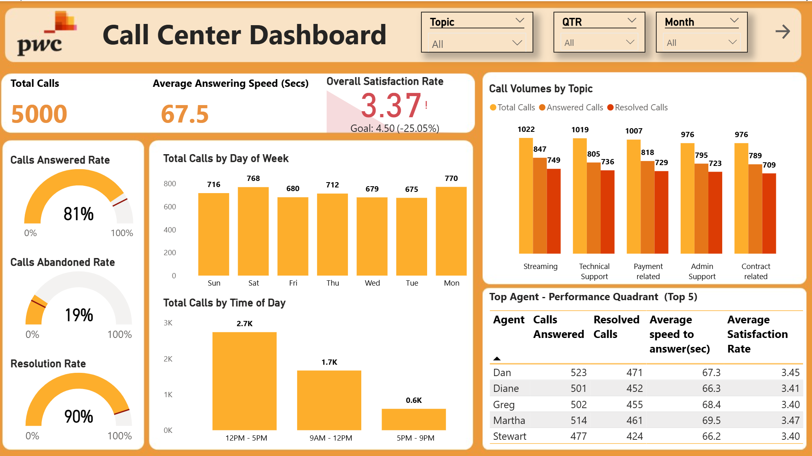
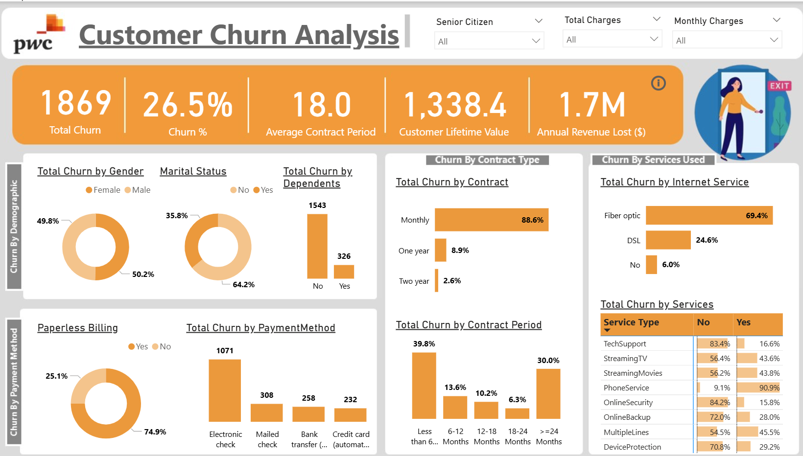
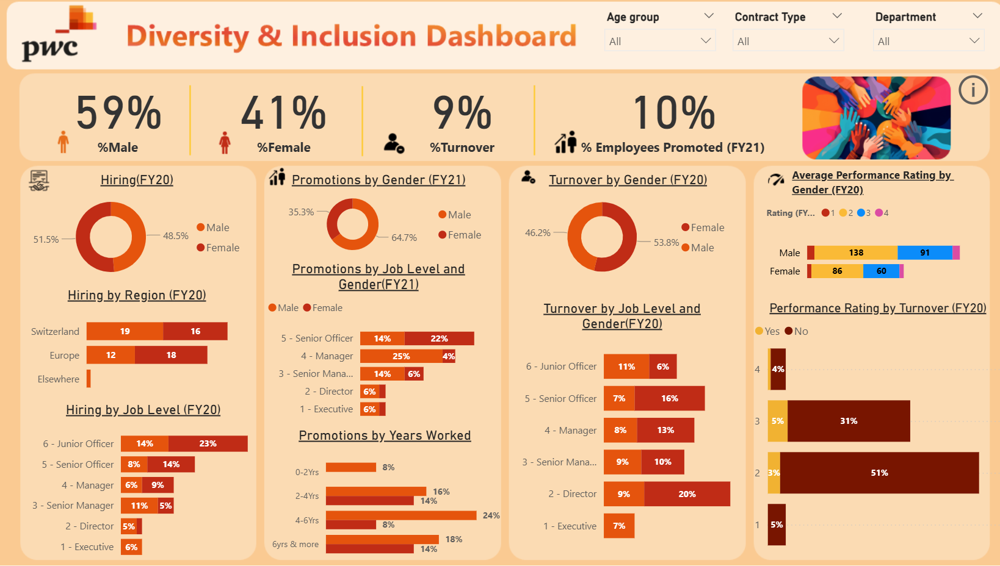

# Power BI Dashboards | PwC Power BI Internship Program

Three interactive Power BI dashboards developed as part of the PwC Power BI Job Simulation, translating complex business data into executive-ready insights across customer service operations, customer retention, and workforce diversity.

**Tools used:** Power BI (Power Query, DAX, Data Modelling, Reporting)

---

## About This Project

End-to-end solo project covering data modelling, DAX measure development, and dashboard design across three independent business problems. Each dashboard was built to answer a specific business question and designed for a non-technical executive audience.

---

## Business Problem

Three separate business problems were addressed across three dashboards:

1. **Call Center Performance** — a telecom call centre managing 5,000 monthly interactions had no visibility into agent performance, resolution rates, or demand patterns, with customer satisfaction tracking 25% below target
2. **Customer Churn Analysis** — a telecom company was losing 1,869 customers (26.5% churn rate), resulting in $1.7M in annual revenue loss, with no structured understanding of who was leaving or why
3. **Diversity and Inclusion** — an organization struggling with gender imbalance at the executive level had no data infrastructure to understand where gaps were occurring across hiring, promotions, and turnover

---

## Approach

Each dashboard was structured around a specific business question with targeted DAX measures and interactive filtering:

- **Call Center Performance** — tracked KPIs across call volume, response speed, resolution rates, agent performance, and satisfaction scores. Built a Top Agent Performance Quadrant ranking the top 5 agents. Dynamic Topic, Quarter, and Month slicers enable cross-filtering across the dashboard
- **Customer Churn Analysis** — segmented 7,000+ customers across demographics, contract types, internet services, payment methods, and tenure. Multi-dimensional DAX measures calculated churn rates by segment to identify the strongest predictors of attrition
- **Diversity and Inclusion** — analyzed gender-related KPIs across hiring (FY20), promotions (FY21), turnover (FY20), and performance ratings — segmented by job level, department, age group, contract type, and tenure

---

## Dashboard Preview

**Dashboard 1 — Call Centre Performance**

> Calls answered rate · Resolution rate · Average speed to answer · Overall satisfaction score · Top agent performance quadrant · Call volume by time period and topic

---

**Dashboard 2 — Customer Churn Analysis**

> Churn rate by contract type · Churn by demographics · Revenue at risk · Churn by service usage · Tenure analysis

---

**Dashboard 3 — Diversity & Inclusion**

> Hiring split by gender · Promotion rate by gender and job level · Turnover by gender and department · Performance ratings by gender

---

## Key Findings

**Call Center Performance**
- Overall satisfaction rate of 3.37 vs target of 4.50 — a 25.05% gap flagged for immediate management attention
- Call volumes peak between 12PM–5PM (2,700 calls) — enabling targeted staffing interventions during critical hours
- 19% abandoned call rate highest in February, directly impacting overall answering rate
- Streaming services and payment-related inquiries recorded the highest volume of unresolved calls — identified for targeted agent coaching

**Customer Churn Analysis**
- $1.7M in annual revenue loss quantified and attributed to specific customer segments for targeted retention action
- Month-to-month contract holders account for 88.6% of all churn — recommended proactive outreach at the 3-month and 24-month milestones with exclusive retention offers
- Senior citizens churn at 41.7% — significantly above the 26.5% average — flagged as highest-risk segment
- 39.8% of customers churn within the first 6 months — early engagement and onboarding improvement identified as the highest-impact retention lever

**Diversity and Inclusion**
- Men represent 59% of the workforce with the gap most pronounced in the 30–39 age bracket where men hold a 73% majority
- Men secured 64.7% of promotions in FY21 — promotion gap at Director level and above identified for immediate process review
- 100% female turnover in executive-level part-time positions (Job Levels 4, 5, and 6) — a critical retention risk escalated to leadership
- Job Level 2 (Director) has the highest female turnover rate (50%) within Operations — targeted retention strategies recommended

---

## Repository Contents

| File | Description |
|---|---|
| `Call Center Dashboard Project.pbix` | Call centre performance Power BI dashboard |
| `Customer Churn Analysis.pbix` | Customer churn analysis Power BI dashboard |
| `Diversity Inclusion Dashboard.pbix` | Workforce diversity and inclusion analytics dashboard |
| `PwC_PowerBI_Dashboards.pptx` | Project presentation with dashboard walkthrough and key findings |

---

## Connect

[LinkedIn](http://www.linkedin.com/in/shobhitasohal)
